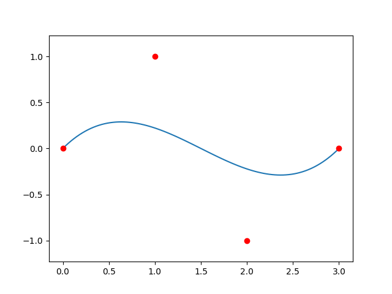
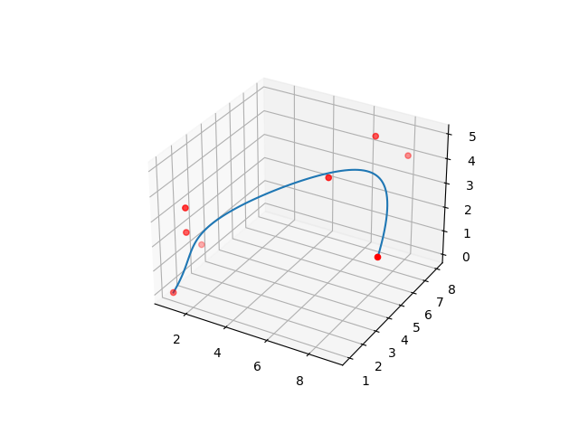
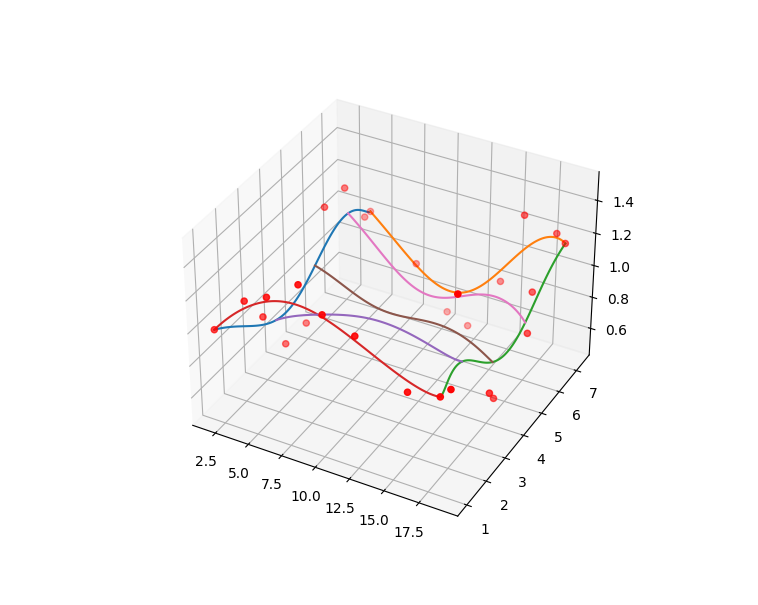

# bezier-matrix
2D and 3D bezier matrix

- 4_2Dbezier_matrix.py
    -  in this file, we have a 4*4 bezier matrix

- 8_3Dbezier_matrix.py
    - we have a 8*8 bezier matrix , and we draw a 3D bezier curve

- coons_patch.py
  - draw a 3D coons patch

